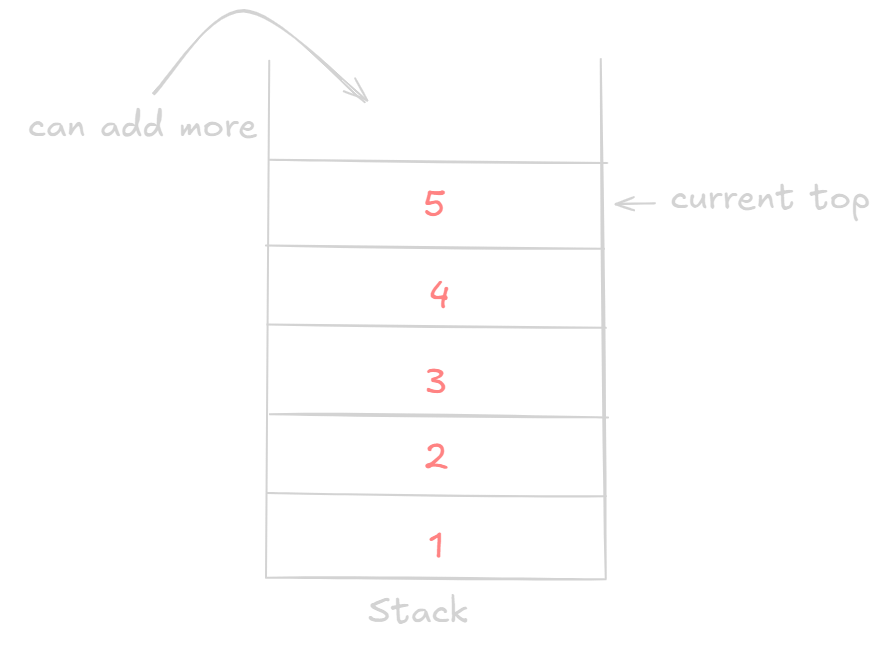

# Stack

Stacks does follow **LIFO (Last In First Out)**.
Indexing is **not allowed**.

`demo.cpp`

```cpp
#include <iostream>
#include <stack>

using namespace std;

int main()
{
    stack<int> st;

    st.push(1);
    st.push(2);
    st.push(3);
    st.push(4);
    st.emplace(5);

    cout << st.top() << endl;
}
```

`output.txt`

```txt
5
```

There are other functions such as `pop(),top()` which acts similar to others.

