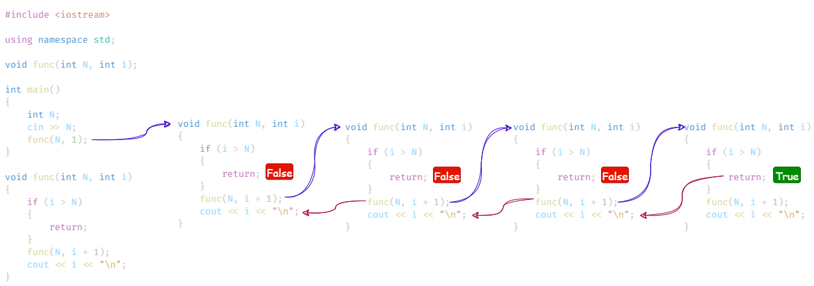

## Question 01

Printing name 5 times.

`input.txt`

```txt
abbyys
```

`demo.c`

```cpp
#include <iostream>

using namespace std;

void func(std::string name, int n, int i);

int main()
{
    std::string name;
    cin >> name;
    func(name, 5, 1);
}

void func(std::string name, int n, int i)
{
    if (i > n)
    {
        return;
    }
    cout << "Hello " << name << "\n";
    func(name, n, i + 1);
}
```

`output.txt`

```txt
Hello abbyys
Hello abbyys
Hello abbyys
Hello abbyys
Hello abbyys
```

Time complexity = O(N)
Space complexity = O(N)

## Question 02

Print linearly from 1 to N.

`input.txt`

```txt
11
```

`demo.cpp`

```cpp
#include <iostream>

using namespace std;

void func(int N, int i);

int main()
{
    int N;
    cin >> N;
    func(N, 1);
}

void func(int N, int i)
{
    if (i > N)
    {
        return;
    }
    cout << i << "\n";
    func(N, i + 1);
}
```

`output.txt`

```txt
1
2
3
4
5
6
7
8
9
10
11
```

Time complexity = O(N).
Space complexity = O(N).

## Question 03

Print from N to 1.

`input.txt`

```txt
11
```

`demo.cpp`

```cpp
#include <iostream>

using namespace std;

void func(int N, int i);

int main()
{
    int N;
    cin >> N;
    func(N, 1);
}

void func(int N, int i)
{
    if (i > N)
    {
        return;
    }
    func(N, i + 1);
    cout << i << "\n";
}
```

`output.txt`

```txt
11
10
9
8
7
6
5
4
3
2
1
```

Time complexity = O(N).
Space complexity = O(N).


